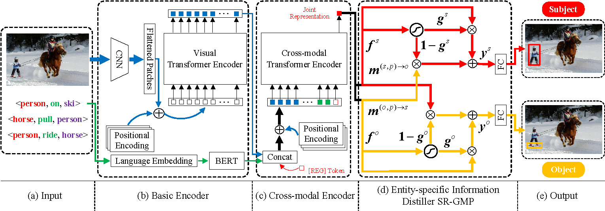

# [VRR-TAMP](https://ieeexplore.ieee.org/stamp/stamp.jsp?tp=&arnumber=9976944)

> **One-Stage Visual Relationship Referring With Transformers and Adaptive Message Passing**, (TIP 2022)<br>
> Hang Wang, Youtian Du, Yabin Zhang, Shuai Li, and Lei Zhang. <br>

> Hang Wang<sup>1,2</sup> |
> Youtian Du<sup>2</sup> |
[Yabin Zhang](https://ybzh.github.io/)<sup>2</sup> |
[Shuai Li](https://scholar.google.com/citations?user=Bd73ldQAAAAJ&hl=zh-TW)<sup>2</sup> |
[Lei Zhang](https://www4.comp.polyu.edu.hk/~cslzhang/)<sup>2</sup> <br>
<sup>1</sup>Xi'an Jiaotong University, <sup>2</sup>The Hong Kong Polytechnic University<br>

### Abstract
There exist a variety of visual relationships among entities in an image. Given a relationship query <subject, predicate, object>, the task of visual relationship referring (VRR) aims to disambiguate instances of the same entity category and simultaneously localize the subject and object entities in an image. Previous works of VRR can be generally categorized into one-stage and multi-stage methods. The former ones directly localize a pair of entities from the image but they suffer from low prediction accuracy, while the latter ones perform better but they are cumbersome to localize only a couple of entities by generating a rich amount of candidate proposals. In this paper, we formulate the task of VRR as an end-to-end bounding box regression problem and propose a novel one-stage approach, called VRR-TAMP, by effectively integrating Transformers and an adaptive message passing mechanism. First, visual relationship queries and images are respectively encoded to generate the basic modality-specific embeddings, which are then fed into a cross-modal Transformer encoder to produce the joint representation. Second, to obtain the specific representation of each entity, we introduce an adaptive message passing mechanism and design an entity-specific information distiller SR-GMP, which refers to a gated message passing (GMP) module that works on the joint representation learned from a single learnable token. The GMP module adaptively distills the final representation of an entity by incorporating the contextual cues regarding the predicate and the other entity. Experiments on VRD and Visual Genome datasets demonstrate that our approach significantly outperforms its one-stage competitors and achieves competitive results with the state-of-the-art multi-stage methods.

Overall framework of VRR-TAMP:



## Prerequisites

Create the virtual python environment with the ```requirements.txt``` file:

```python
conda create -n VRR-TAMP python=3.6.5
pip install -r requirements.txt
```

Activate the environment with:

```python
conda activate VRR-TAMP
```

## Installation

Please refer to [DETR](https://github.com/facebookresearch/detr) and download model weights of ResNet50 `detr-r50-e632da11.pth`. Please store it in `./saved_models/`.

## Train and Evaluate

```
python main.py --train
```

## Acknowledgement

Thanks for works of [TransVG](https://github.com/nku-shengzheliu/Pytorch-TransVG), [DETR](https://github.com/facebookresearch/detr) and [ReSC](https://github.com/zyang-ur/ReSC). Our code is based on these implementations.


## Citation 
```
@article{wang2022one,
  title={One-Stage Visual Relationship Referring With Transformers and Adaptive Message Passing},
  author={Wang, Hang and Du, Youtian and Zhang, Yabin and Li, Shuai and Zhang, Lei},
  journal={IEEE Transactions on Image Processing},
  volume={32},
  pages={190--202},
  year={2022},
  publisher={IEEE}
 }
```


